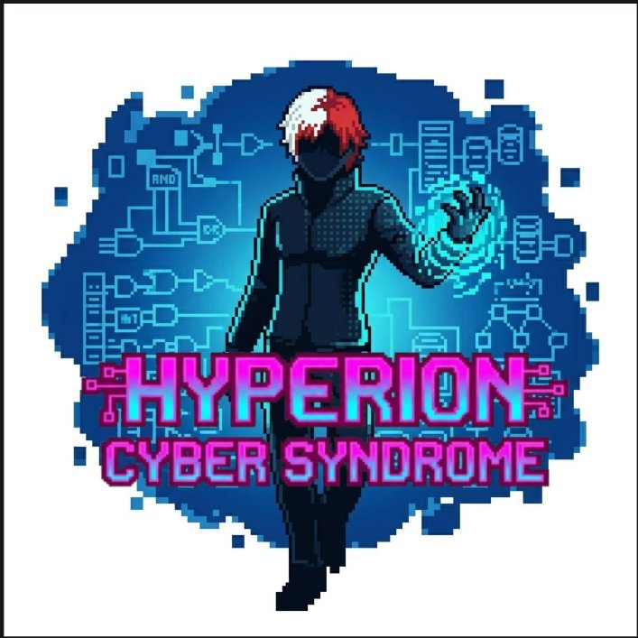
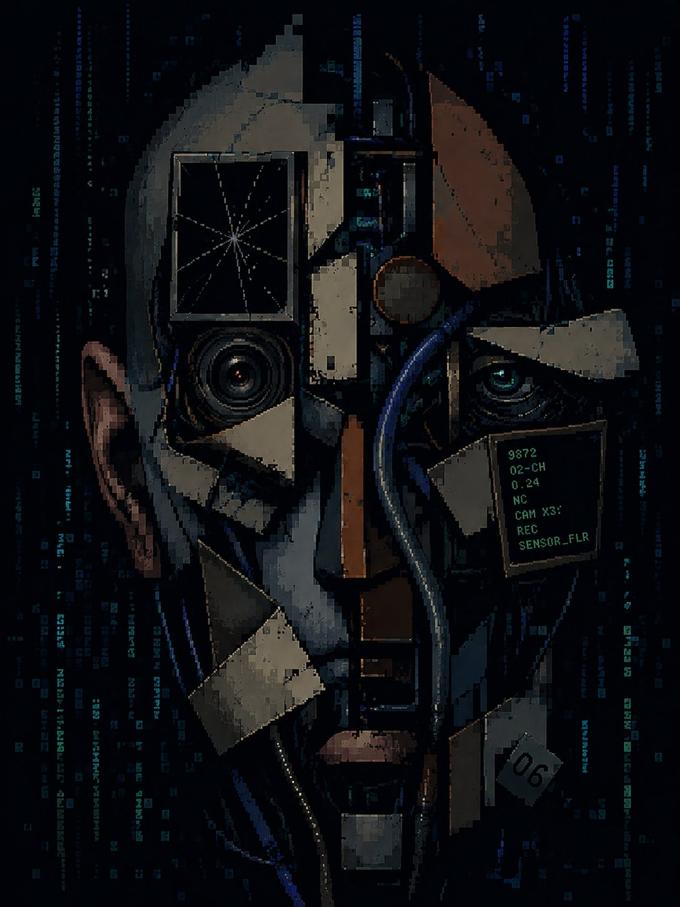

<div align="center">



# CYBER SYNDROME: HYPERION

> *"Año 2086. La Red Hyperion está infectada. El Glitch del Odio consume a los estudiantes desde adentro. Solo el Dr. Walter D. White puede detenerlo."*

[]()
[]()
[]()

</div>

---

## 🌐 Contexto / Lore

**Año 2086.** La humanidad ya no se comunica en el mundo físico. Toda la vida escolar, social y académica de los jóvenes ocurre dentro de **La Red Hyperion**, un mega-servidor de realidad virtual.

Sin embargo, la Red ha sido infectada. No por un virus común, sino por una mutación digital conocida como **el Glitch del Odio**: una fuerza oscura nacida de la acumulación de bullying, ciberacoso y toxicidad. Está haciendo colapsar los servidores y materializando las peores inseguridades de los estudiantes en forma de monstruos de datos.

**Tú eres el Dr. Walter D. White**, jefe de psiquiatría cibernética de la corporación **HappyTech**. Tu misión: conectarte al núcleo de la red, escanear los mensajes infectados, salvar la mente de los estudiantes y evitar el colapso total.

---

## 🎮 Modos de Juego

### Fase 1 — Psicólogo Digital *(Triaje Emocional)*
El Dr. White entra a la base de datos central. Los mensajes están encriptados y mezclados con código corrupto. Debes leerlos, calcular su nivel de riesgo y decidir: **Archivar**, **Seguimiento** o **Reportar**. Los estados del sistema van de `NORMAL` → `OBSERVACIÓN` → `ALERTA` → `CRÍTICO`. Si el sistema llega a estado crítico, el Glitch del Odio gana.

### Fase 2 — Detección Rápida *(Cortafuegos de Reflejos)*
Los Trolls del Ciberacoso lanzan una ráfaga masiva de mensajes. Caen a velocidad de la luz. Con tus reflejos debes clasificarlos como **Positivo**, **Normal** o **Negativo**. Más de 5 errores y el escudo mental del Dr. White colapsa.

### Fase 3 — Aislando el Bullying *(Contención de Redes)*
La comunidad está desbordada. Cada jugador (2–6) es un orientador escolar con casos que distribuir en 6 canales de atención. Un dado determina el canal. Los canales 1–5 tienen capacidad limitada: si se desbordan, los casos regresan y pierdes el turno. El **Canal 6** es la Nube Cuántica de HappyTech: ilimitada, siempre disponible.

---

## 🧮 Módulo 2 — Menú Matemático HappyTech

Operaciones matemáticas implementadas en Java (Netbeans):

- **Eliminar un dígito** de un número dado
- **Cálculo de PI** (serie de Leibniz) y **número de Euler** (serie e^x)
- **Funciones trigonométricas** con series de Taylor (sin, cos y derivadas)

---

## 🗂️ Estructura del Proyecto

```
cyber-syndrome-hyperion/
│
├── README.md
├── .gitignore
│
├── docs/
│   ├── enunciado/          ← Enunciado oficial del laboratorio
│   ├── moodboard/          ← Referencias visuales y mood estético
│   └── manual-usuario/     ← Manual de usuario (próximamente)
│
├── assets/
│   ├── logo/               ← Logo oficial del juego
│   └── lore/               ← Textos y narrativa del universo
│
├── src/
│   ├── processing/
│   │   └── CyberSyndrome/  ← Módulo 1: videojuego en Processing
│   └── java/
│       └── HappyTechMath/  ← Módulo 2: miscelánea matemática en Netbeans
│
└── slides/                 ← Presentación ejecutiva (próximamente)
```

---

## 🎨 Moodboard & Estética

La estética visual del juego se inspira en el cyberpunk oscuro: neón sobre negro, glitch effects, pixel art y fragmentación digital.

<div align="center">



*Imagen conceptual del Glitch del Odio — villano principal de la narrativa*

</div>

> **Nota:** La imagen conceptual fue generada con IA a partir de una referencia externa. No es obra original del equipo ni forma parte del juego. SSe incluye únicamente como referencia de mood board para ilustrar la dirección estética del proyecto. Está previsto reemplazarla por una ilustración propia del equipo en una versión futura.

---

## 👾 Equipo — Team Breaking Bugs

| Integrante | Rol inicial |
|---|---|
| Luis Padilla | --- |
| Moises Jacome | --- |
| Ferney Jimenez | --- |

> *Los roles se intercambian durante el desarrollo según las reglas del laboratorio.*

---

## 📅 Fechas Clave

| Evento | Fecha |
|---|---|
| Entrega del proyecto | 25 de mayo de 2026 |
| Sustentación | 26 de mayo de 2026 |
| Feria Gamer | 28 de mayo de 2026 |

---

## 🛠️ Tecnologías

- **Java** — Netbeans IDE
- **Processing** — IDE Processing (Java mode)
- Estructuras utilizadas: condicionales, ciclos y estructuras básicas

---

<div align="center">

*Team Breaking Bugs — Laboratorio Final 2026_10*

</div>
